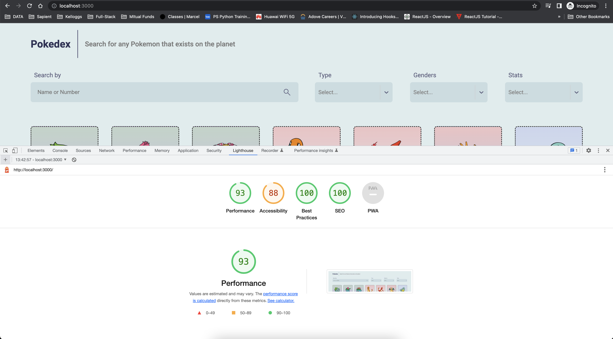

# rahkumar27-pokemon-app


## Package Installed

```
1. npm i styled-components
2. npm i react-select
3. npm i axios
4. npm i react-infinite-scroll-component
5. npm install --save-dev jest babel-jest @babel/preset-env @babel/preset-react react-test-renderer
6. npm i --save-dev enzyme enzyme-adapter-react-16
```


### Basic Commands

```
1. npm start
2. npm run build
3. npm run test
4. npm cache clean --force
```


## Features

### Design & Structure

- UI design with Mobile First Approach
- Using core CSS with Flex & Grid
- Using Styled Components with seperate file
- Using Reusablity of components (with structured in seperate folders/files)
- Adding Additional methods in to a shared File/Folder
- Updated Pokemon 'Favicon icon'
  


### API Calling

- Fetching all 'Pokemon' list 
- Fetching 'Genders' list 
- Fetching 'Pokemon Species' list
- Fetching 'Evolution Chain' list


### Searching Functionalities

- Searching By ID
- Searching By Name
- Filtering by Types
- Filtering By Gender
- Filtering By Stats


### NFRs

- Accessibility (89%)
- SEO (100%)
- Performance (93%)
- Auditing Tools ('Light House' Chrome Extension)


### Unit Testing

- Using Jest Framework
- Test Coverage ()


### Additional Features

- Virtual Scrolling
- Lazy Loading
- Custom Hooks
- Redux (Not Now)


## App Link

- <a href="https://rahul-pokedex.netlify.app/" target="_blank"><strong>Click here</strong></a> to view the application


## Report Screenshot

### NFRs Report


